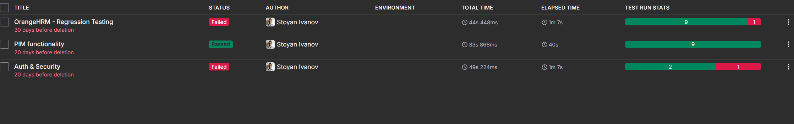

# OrangeHRM Manual Testing Project

## Project Overview

This repository contains a manual testing project for the OrangeHRM Open-Source demo application.

The application was tested using exploratory and structured manual testing techniques due to the absence of formal requirements documentation.

The goal of this project is to demonstrate practical QA skills including test case design, execution, and defect reporting.
## Live Project Links
*   Live Test Repository: https://app.qase.io/project/OHRM

---

## Application Under Test

https://opensource-demo.orangehrmlive.com

---

## Tools Used

- Qase.io: Test Case Management and Test Execution
- Jira: Defect Tracking

---

## Test Execution Summary

The project includes multiple test execution cycles:

- Regression Testing: 10 test cases executed (9 Passed, 1 Failed)
- PIM Smoke Testing: 9 test cases executed (9 Passed)
- Auth & Security Testing: 3 test cases executed (2 Passed, 1 Failed)

---

## Tested Modules

### Admin Module
- User management (CRUD operations)
- Form validation
- Input boundary testing
- Password validation checks

### Leave Module
- Filter functionality
- Leave calculation logic
- Approval workflow (Approve / Reject / Cancel)

---

## Bug Report (Sample)

### Bug ID: D-3 (Qase) / Jira Linked Issue

**Title:** UI inconsistency in "Show Leave with Status" dropdown after reset

**Severity:** Major

**Expected Result:**
The dropdown and filter tag should be consistent. After reset, both should return to default state or reflect the same value.

**Actual Result:**
The dropdown shows "-- Select --", but the "Pending Approval" filter tag remains active below it, causing UI inconsistency.

**Impact:**
This creates confusion because the UI state does not match the active filter state.

---

## Summary

This project demonstrates manual QA testing skills including:

- Test case design and execution
- Exploratory testing techniques
- Defect identification and reporting
- Use of test management tools (Qase) and issue tracking (Jira)

It reflects practical experience with structured QA workflows on a real demo application.

